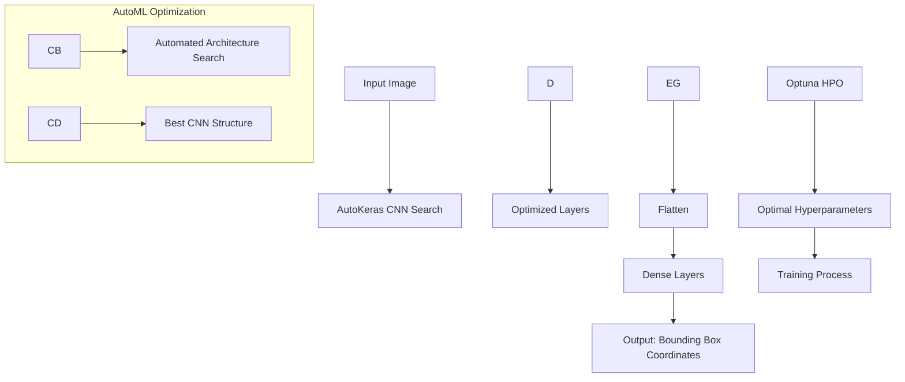

### **1. AutoML-Enhanced Face Detection Model**

This graph represents the architecture with AutoML optimization:



### Project Structure

```
face_detection/
│
├── data/
│   ├── data_loader.py      # Handles loading and preprocessing of WIDER face dataset
│   ├── wider_face_split/   # Dataset split information and annotations, including readme.txt
│   ├── WIDER_test/         # Test dataset images
│   ├── WIDER_train/        # Training dataset images
│   └── WIDER_val/          # Validation dataset images
│
├── model/
│   ├── network.py          # Contains the CNN architecture implementation
│   └── layers.py           # Custom layer implementations if needed
│   └── automl.py           # AutoML integration (AutoKeras + Optuna)
│
├── utils/
│   ├── visualization.py    # Functions for visualizing results and training progress
│   └── preprocessing.py    # Image preprocessing, augmentation functions, and data preprocessing script
│
├── train.py                # Main training script
├── evaluate.py             # Evaluation script for testing model performance
├── predict.py              # Script for making predictions on new images
├── config.py               # Configuration parameters and hyperparameters
└── requirements.txt        # Project dependencies
```

### File Descriptions

1. **data/data_loader.py**

   - Dataset loading and handling
   - WIDER face dataset integration
   - Batch generation for training
   - Data augmentation pipeline
   - Annotation processing (including converting and filtering annotations)

2. **utils/preprocessing.py**

   - Image preprocessing functions:
     - Resizing images to consistent size (256x256 pixels)
     - Normalizing pixel values (dividing by 255 to scale between 0 and 1)
   - Data augmentation utilities
   - Preprocessing script (preprocess_and_save) to save images and annotations as a structured .npz file

3. **model/network.py**

   - AutoKeras-based CNN architecture
   - Model class with forward pass logic
   - Loss function implementation
   - Integration with AutoML components
   - AutoKeras model adaptation
   - Training and validation step definitions

4. **model/layers.py**

   - Custom layer implementations if needed
   - Any specialized architectures or modules

5. **model/automl.py**

   - AutoKeras setup and configuration
   - Optuna hyperparameter optimization
   - Simple ENAS integration options
   - AutoML utilities and helpers

6. **utils/visualization.py**

   - Training progress visualization
   - Loss and accuracy plotting
   - Bounding box visualization
   - Prediction result display

7. **train.py**

   - Training loop implementation
   - Model checkpointing
   - Training progress logging
   - AutoML training coordination
   - Validation during training

8. **evaluate.py**

   - Model evaluation on test set
   - Performance metrics calculation
   - Results logging and analysis

9. **predict.py**

   - Inference pipeline
   - Single image prediction
   - Batch prediction capabilities
   - Result visualization

10. **config.py**

    - AutoML search space configuration
    - Optuna trial definitions
    - Training configuration
    - Data preprocessing parameters:
      - Image size configuration (256x256)
      - Normalization parameters
      - Batch size
      - Augmentation settings
    - AutoKeras settings
    - Path configurations

11. **requirements.txt**
    - PyTorch/TensorFlow
    - AutoKeras
    - Optuna
    - NumPy, Pandas
    - OpenCV
    - Visualization libraries
    - Other dependencies
