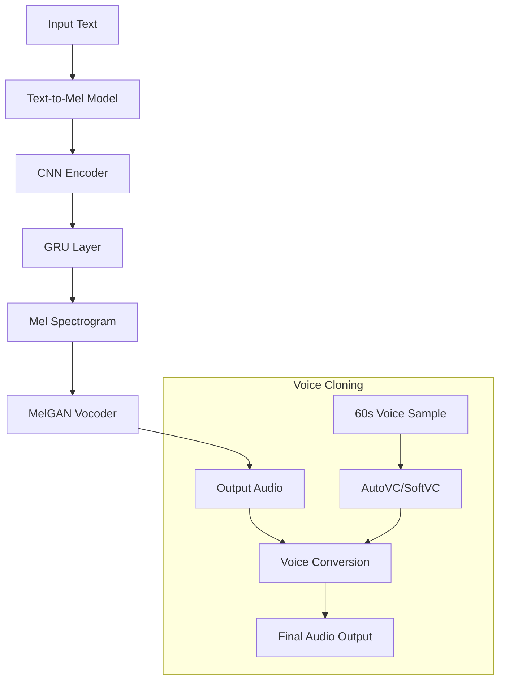

### **1. Simple Text-to-Speech Pipeline**

This graph represents the architecture of the text-to-speech pipeline with an optional voice cloning component:



### Project Structure

```
voice_synthesis/
│
├── data/
│   ├── data_loader.py      # Handles loading and preprocessing of text and audio data
│   ├── text_processing.py   # Text normalization and phoneme conversion
│   └── datasets/           # Training datasets and voice samples
│
├── model/
│   ├── text2mel.py         # Text-to-Mel model implementation (CNN + GRU)
│   ├── vocoder.py          # MelGAN vocoder implementation
│   ├── voice_clone.py      # Optional AutoVC/SoftVC implementation
│   └── layers.py           # Custom layer implementations
│
├── utils/
│   ├── audio.py           # Audio processing utilities
│   ├── visualization.py    # Functions for visualizing spectrograms and training progress
│   └── preprocessing.py    # Audio preprocessing and feature extraction
│
├── train.py               # Main training script
├── evaluate.py            # Evaluation script for model performance
├── synthesize.py         # Script for generating speech from text
├── config.py             # Configuration parameters and hyperparameters
└── requirements.txt      # Project dependencies
```

### File Descriptions

1. **data/data_loader.py**

   - Dataset loading and handling for text and audio
   - Batch generation for training
   - Audio file processing
   - Text preprocessing pipeline
   - Feature extraction (mel spectrograms)

2. **data/text_processing.py**

   - Text normalization
   - Phoneme conversion
   - Text to sequence conversion
   - Special token handling

3. **utils/audio.py**

   - Audio signal processing functions:
     - Mel spectrogram conversion
     - Audio normalization
     - Sample rate conversion
     - Griffin-Lim algorithm (optional fallback)
   - Feature extraction utilities

4. **model/text2mel.py**

   - CNN + GRU architecture implementation
   - Attention mechanism (if used)
   - Loss function implementation
   - Training and validation step definitions
   - Mel spectrogram generation logic

5. **model/vocoder.py**

   - MelGAN architecture implementation
   - Generator and discriminator networks
   - Multi-scale architecture
   - Loss functions (adversarial, feature matching)
   - Audio synthesis from mel spectrograms

6. **model/voice_clone.py**

   - AutoVC/SoftVC implementation
   - Voice embedding extraction
   - Voice conversion logic
   - Speaker adaptation methods

7. **utils/visualization.py**

   - Training progress visualization
   - Loss and accuracy plotting
   - Spectrogram visualization
   - Attention alignment plots
   - Audio waveform display

8. **train.py**

   - Training loop implementation
   - Model checkpointing
   - Training progress logging
   - Multi-stage training (Text2Mel, Vocoder, Voice Cloning)
   - Validation during training

9. **evaluate.py**

   - Model evaluation metrics
   - MOS (Mean Opinion Score) calculation
   - Audio quality assessment
   - Speaker similarity evaluation (for voice cloning)
   - Results logging and analysis

10. **synthesize.py**

    - Text-to-speech generation pipeline
    - Voice cloning inference
    - Batch synthesis capabilities
    - Audio export functionality
    - Real-time synthesis options

11. **config.py**

    - Model hyperparameters:
      - Mel spectrogram parameters
      - Model architecture settings
      - Training configuration
      - Audio processing parameters:
        - Sample rate (22050 Hz)
        - Hop length
        - Window size
        - Mel filterbank size
    - Training settings:
      - Batch size
      - Learning rates
      - Training steps
    - Path configurations

12. **requirements.txt**
    - PyTorch/TensorFlow
    - librosa
    - numpy, scipy
    - sounddevice
    - phonemizer
    - matplotlib
    - tqdm
    - Other dependencies
